# How Responder Works

This guide follows one message from admission through Slack delivery and explains where state,
memory, authority, retries, and cleanup live. It describes the current single-host implementation,
not a future multi-tenant design.

Conversational responses follow the teammate's current Slack location. Top-level conversation stays
in the channel, thread conversation stays in that thread, and explicit requests to move are
host-parsed before model execution. Multi-step configuration sessions persist every message root
they own so moving between channel and thread does not lose state or admit unrelated replies.

## 1. System map and authority boundaries

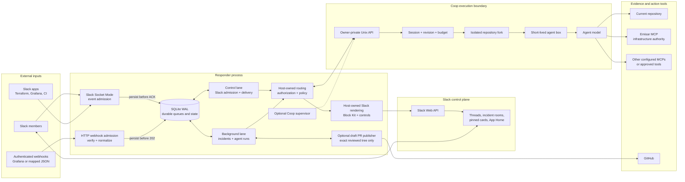

Authority is deliberately split:

| Boundary | Owner | Responder cannot bypass it |
| --- | --- | --- |
| Slack identity, event admission, conversation routing, durable queues | Responder | Slack membership and configured operator checks |
| Repository allowlist, fork, agent target, projected capabilities, box, revision, turn budget | Coop | Contributor policies omit shared MCP and environment secrets; Coop policy and revision conflicts remain authoritative |
| Live infrastructure identity, action schemas, policy, approval, execution, audit | Emisar | Emisar authorization and approval decisions |
| Draft branch publication | Responder publisher | Exact Coop-reviewed tree, lease-protected branch, draft PR only |
| Merge, signing, deployment | External human-controlled workflow | No Responder operation exists for these actions |

Slack and webhook secrets stay in Responder. The Emisar key is projected into the short-lived Coop
box through Coop's private configuration; it is not sent in prompts. Slack never receives Coop's
filesystem or terminal protocol.

### The work-episode kernel

Every accepted model-backed request creates one durable work episode before execution. Four
independent decisions define it:

| Policy | Stored decision | What it controls |
| --- | --- | --- |
| Engagement | Slack admission and attention score | Whether Responder should participate |
| Effort | `conversational`, `focused_check`, `operational_assessment`, `incident_investigation`, or `engineering_task` | How much evidence and validation completion requires |
| Authority | `read_only`, `repository_write`, or `governed_operation` | Which external effects the host and downstream policy may permit |
| Communication | channel context, reply location, preferences, and native status | Where and how Responder communicates |

Effort never grants authority. A deep health review can remain read-only, and a narrowly scoped
governed operation can require approval without becoming an incident investigation. The episode
stores its objective, required coverage, completion criteria, phase, next action, and an ordered
progress ledger. This state survives process restarts and is also the source of active commitment
bookkeeping.

Operational assessments and incident investigations may finish only when every required layer is
assessed and the result is decision-ready, or when Responder reaches a real external boundary. A
blocked result must classify that boundary as an unavailable source, denied access, required
operator input, an authority boundary, or a tool failure; record what it already attempted; name
every material gap; and state the external action that unblocks the work. "Query the metrics" or
"investigate the errors" is unfinished read-only work, not a blocker. The host rejects and retries
that result instead of presenting it as final.

A healthy host probe alone therefore cannot complete an end-to-end production-health request.
When a genuine blocker remains, Slack adds a compact *Assessment incomplete* section showing what
is still unverified, what Responder already tried, and what must happen next. The durable episode
remains open rather than silently turning a partial assessment into completed work.

## 2. Slack event admission and routing

Socket Mode handlers do minimal synchronous work: validate the workspace and event shape, persist a
deduplicated `slack_inputs` row, and only then acknowledge Slack. The worker makes the expensive
decision later. A persistence or policy-resolution failure before that point is not acknowledged,
so Slack can redeliver the envelope instead of Responder silently losing it.

Nothing that talks to Slack happens on the socket consumer, including work that looks trivial.
Refreshing the App Home is a Slack round trip, so it is admitted as an ordinary input and performed
by the control lane; doing it inline would hold the single consumer and delay admission of every
event behind it.

Reactions cross their own passive-feedback boundary too. Adding or removing an emoji on one of
Responder's exact delivered messages is retained as ordered episode context and refreshes the current reaction state without starting
a separate agent turn. A reaction is social feedback: it never authorises an approval, a repository
change, an incident, or an infrastructure action.

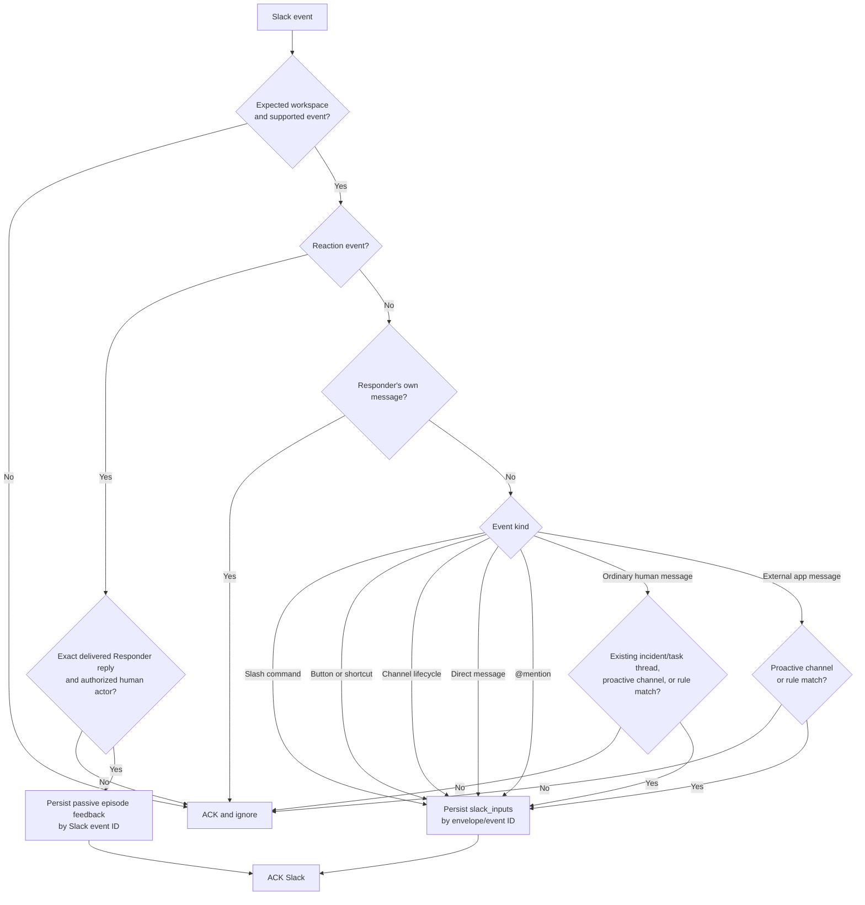

Slack channel-join events for the bot are admitted immediately and atomically record the durable
setup input and membership transition. Separately, a bounded scheduler calls `users.conversations`
to reconcile only conversations the bot belongs to. It detects any missed absent-to-present
transition and persists a synthetic `channel_joined` input. Both paths are durable and deduplicated,
so restarts cannot duplicate or lose onboarding.

After acknowledgement, the durable worker applies the more expensive authorization and conversation
routing:

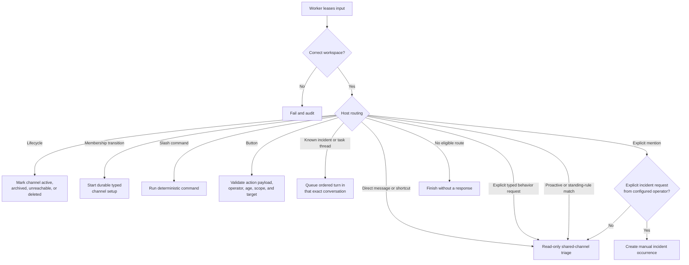

Important routing behavior:

- A direct message or **Investigate message** shortcut always enters read-only triage.
- When Slack reports that the bot joined a channel, Responder opens one durable setup conversation.
  Operator answers advance a host-owned typed draft; a confirmation button bound to the stored
  session ID is required before settings change.
- A plain channel message is never a command. The model classifies intent and the host executes the
  typed result; there is no keyword table rewriting free text into a subcommand. Conversational
  results are threaded publicly, while the four `/responder` verbs answer only the operator who
  typed them.
- An explicit `@mention` always summons read-only triage in any channel where Emisar is a member.
  Proactive participation, shadow evaluation, and app-alert policy remain channel-configured.
- A successfully delivered triage reply opens a 30-minute continuation window at that channel or
  thread location. Human follow-ups are admitted without another mention; a reply that starts a
  thread from Emisar's top-level answer is treated as the same exchange.
- Messages already bound to an incident room or engineering-task thread stay in that conversation.
- Broad proactivity and deterministic standing rules are separate. A rule can admit its matching
  event while general proactive triage is off.
- A typed standing-rule match starts a model evaluation but does not force speech. The model may
  ignore an intermediate or duplicate event, react, or reply when the message and read-only tools
  provide a useful result. Later lifecycle updates are evaluated fresh. Terraform findings still
  require the exact plan or a read-only lookup of that run; commit history is context, not a
  substitute.
- Human senders must be active full workspace members. Members may confirm channel-bound
  contributor tasks. Incident steering, operator-capability tasks, publication, destructive task
  controls, channel configuration, and governed operations require a configured operator.
- Responder ignores its own posts, foreign-workspace events, unsupported subtypes, guests, and
  Slack Connect users that do not satisfy the membership boundary.

## 3. One complete shared-channel triage turn

This is the path used for direct messages, message shortcuts, summon mentions, proactive channel
messages, and standing-rule matches.

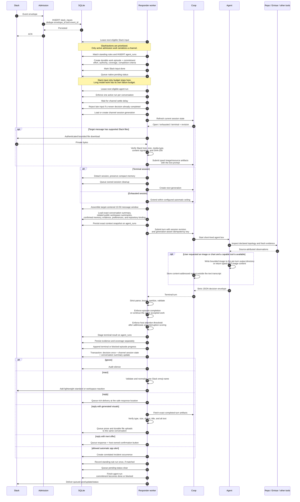

Attachment bytes are deliberately turn-scoped. Responder stores Slack-owned file metadata so a
durable retry can repeat the authenticated download, but it never serializes a private URL or file
body into the prompt, compact conversation memory, evidence ledger, or Slack response. Coop stores
the bounded payload only until the turn completes, fails, or is cancelled, then deletes it. When a
triage answer offers an engineering task, accepting that offer queues the initial writable turn
against the original Slack input so the same screenshot or document reaches the isolated task fork.

The model does not return arbitrary Slack blocks or inline binary data. It returns a strict decision
envelope containing prose, optional references to exact current-turn image artifacts, evidence,
coverage, compact memory, and at most one inert offer. Responder owns buttons, file uploads,
confirmation dialogs, mentions, approval links, accessibility text, limits, and persistence.

Generated visuals are a typed output channel, not memory or evidence. Coop accepts only bounded
PNG, JPEG, WebP, and GIF files from a fresh per-turn directory or typed ACP image/resource blocks,
then removes the directory. Responder fetches only artifacts explicitly referenced by the final
decision, rechecks their SHA-256 and byte count, and queues them after the reply at the same channel
or thread location. A deterministic filename lets uncertain Slack uploads reconcile exactly once.
Charts must cite their underlying observations and time range; creative images may have no evidence.

For shared-channel work, accepted decisions are:

| Decision | Effect |
| --- | --- |
| `ignore` | Audit the decision and post nothing |
| `reply` | Post a bounded rich response where a human is speaking; keep app alerts and standing rules in the source thread |
| Reply plus incident offer | Show **Open incident room**; create nothing until confirmed |
| Reply plus engineering-task offer | Show **Start task**; create no writable fork until confirmed |
| Reply plus incident and prepared-fix offers | Show **Open incident room** and **Prepare code fix** independently; incident creation requires an operator, while any active full member may confirm the thread task |
| Reply plus memory/preference/rule offer | Show a typed confirmation; save nothing until confirmed |
| Automatic incident | Allowed for a credible unresolved monitoring-app alert, not an ordinary human health question |

## 4. Memory, context, evidence, preferences, and rules

Responder does not have one undifferentiated memory. It has separate stores because conversation
continuity, factual hints, current evidence, and executable behavior require different trust and
retention rules.

All of it competes for one bounded turn. When the assembled context does not fit, the host chooses
what to drop rather than letting the transport cut the middle out of a structured payload: prior
evidence first, then summaries of other conversations, then the referenced transcript, then
synthesized continuity, then older channel messages down to a floor, and operator-confirmed memory
last because someone put it there deliberately. The target message is never dropped, and every
omission is reported to the model as `context_omitted` — silently thinner context reads as
confident ignorance, while a stated gap is a reason to ask.

Confirmed memory is chosen by relevance to the current request rather than by recency, with an
exact identifier match on an alias, evidence route, or relationship correction always included.
Ordering by recency alone would mean the more the agent is taught, the less of it surfaces.

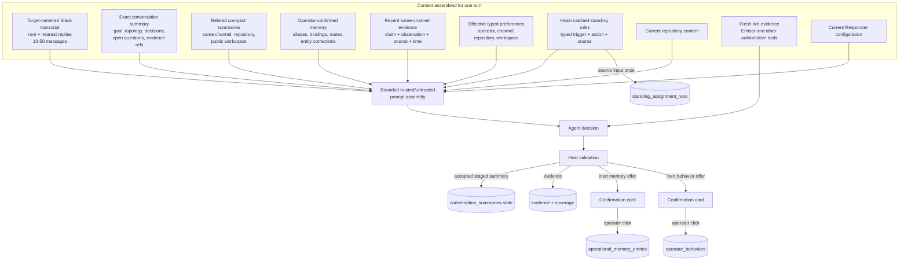

### Memory layers

| Layer | Stored in | Writer | Purpose | Trust and lifetime |
| --- | --- | --- | --- | --- |
| Exact Slack context | Slack history plus `ingress_inbox_entries`, frozen in the Work turn submission | Context assembler | Preserve the thread root and messages nearest the target while avoiding unrelated threads | Raw event context only; bounded inputs and operational-data retention |
| Compact conversation situation | `conversation_summaries.state` | Turn-scoped state tool, published with accepted result | Carry purpose, situation, goal, active topics, topology, decisions, open loops, unresolved questions, and evidence references across turns | Continuity, not current-health proof; compacted after seven days |
| Related workspace situations | Recent `conversation_summaries` selected at prompt assembly | Host-owned context selection | Recall overlapping work from joined public workspace channels | Bounded to eight summaries with same-repository priority; private channels and DMs never cross conversation boundaries |
| Evidence ledger | `evidence`, `coverage`, `timeline_events` | Host after strict agent-report parsing | Preserve source-attributed observations independently of prose | Same-channel recall; time and source remain visible |
| Confirmed durable memory | `operational_memory_entries` | Configured operator click | Durable alias, repository binding, evidence route, or entity relationship | Untrusted hint with explicit scope, expiry, provenance, and caps; never authority or current evidence |
| Confirmed guidance | `operator_behaviors` | Configured operator click | Open-ended collaboration guidance | Advice with explicit scope, expiry, provenance, and caps; never evidence or authority |
| Work commitments | `commitments` projected from `agent_runs` | Host when it accepts model-backed work | Show what Emisar owes, current progress, and the next operator action | Execution state, not prompt memory or evidence |
| Preferences | `operator_behaviors` (`preference`) | Configured operator click | Typed investigation depth or response detail | Closed catalog; precedence and expiry are host-owned |
| Standing rules | `operator_behaviors` (`standing_assignment`) | Configured operator click | Typed channel subscription such as Terraform-plan review | Host matches trigger deterministically; read-only |
| Rule executions | `standing_assignment_runs` | Host | Prevent the same rule/source event from running twice, and record what each fire produced so a rule can be judged | Idempotency record kept on the episode-history horizon; the acted and quiet tallies on `operator_behaviors` outlive it |
| Incident intelligence | Incident, signals, agent runs, evidence, coverage, explicit events, proposals, Emisar approvals, publication | Webhook, host, agent, operators | Coordinate one incident or engineering task and derive its remediation timeline and postmortem | Bound to that work occurrence; source rows remain canonical |

### Evidence precedence

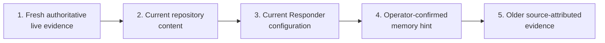

Higher items resolve conflicts with lower items. Memory never proves current health, carries a
credential, grants approval, or authorizes a mutation. The model cannot write confirmed memory,
preferences, or rules directly.

### Typed behavior setup and execution

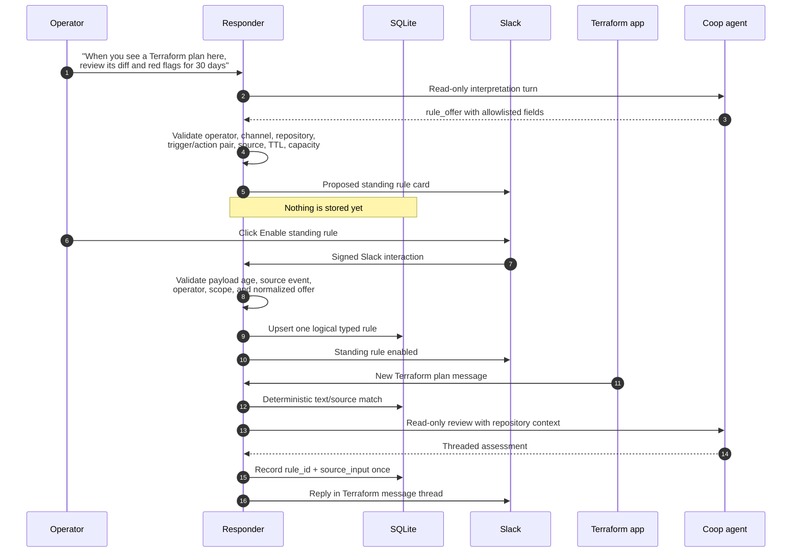

### Learned conversation knowledge

Beside operator-confirmed memory, Responder retains what it learned from a conversation without
anyone confirming it. A completed turn may return `update_memory` carrying typed knowledge items —
a decision, a constraint, a fact, a rationale — each with a status, a confidence, and a link to the
exact Slack message it came from.

This is deliberately weaker than confirmed memory and is labelled as such in the prompt. It is
included only when the host finds concrete lexical overlap with the current request, tentative
items are context rather than conclusions, and nothing learned this way can authorise work,
approve an action, or serve as evidence that a claim is currently true. It exists so the agent
does not ask the same question twice, not so it can act on something nobody agreed to.

### Product feedback

When a message is clearly about Responder itself — a correction, a suggestion, an explicit
complaint about how it behaved — the turn may return one `record_feedback` operation. That is
stored, not acted on. Operational frustration about an outage, a provider, or a person is not
Responder feedback and is not recorded as such.

Open feedback appears on the App Home, grouped by category, where a configured operator can
dismiss it or convert it into durable guidance. Conversion writes an ordinary guidance entry
through the same validation as any other memory, so the model can record feedback but only a
person can turn it into behaviour. Raw feedback never re-enters a prompt: otherwise anyone could
shape how the agent works by typing a complaint into a channel.

Arbitrary remembered prose never becomes an executable trigger or authority. Confirmed open-ended
guidance may steer future model turns, but it cannot initiate work, count as evidence, authorize an
incident or change, approve an action, or override the current request or host policy. Deterministic
behavior remains in the closed host catalog:

- preferences: `health_check_depth`, `response_detail`, and `response_location`;
- triggers: `terraform_plan`, `deployment`, and `operational_alert`;
- actions: `review_terraform_plan`, `verify_deployment`, and `triage_alert`;
- sources: `human`, `app`, or `any`.

## 5. Shared triage, incident rooms, and engineering tasks

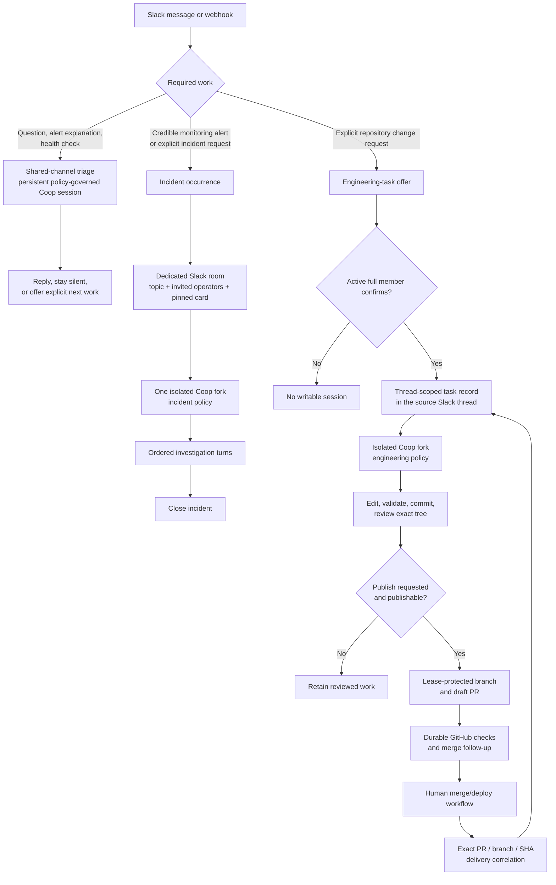

An engineering task uses the same durable work model as incident work but stays attached to the
source thread. Dedicated rooms are reserved for incidents. A shared-channel triage session cannot
edit files; an active full workspace member's confirmation creates the separate writable task
session. Active full members may collaborate there without shared MCP or environment credentials;
a configured operator must publish a reviewed draft PR or use destructive task controls.

## 6. Emisar tools and approval handoff

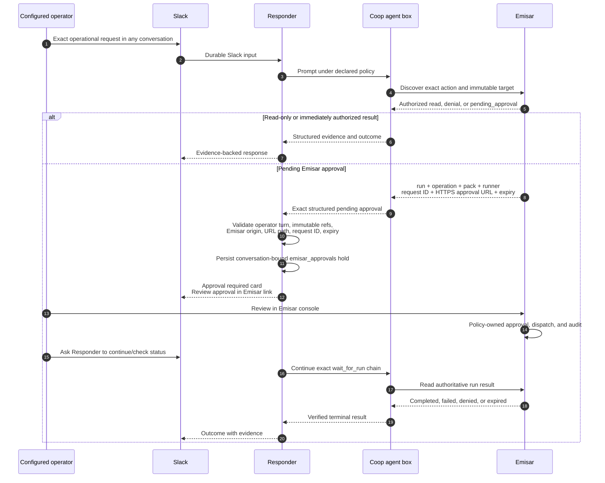

The Slack link never approves an action. Approval authorizes Emisar to dispatch; it is not proof of
successful execution. A later read of the exact run establishes the outcome.

## 7. Durability, ordering, retries, and garbage collection

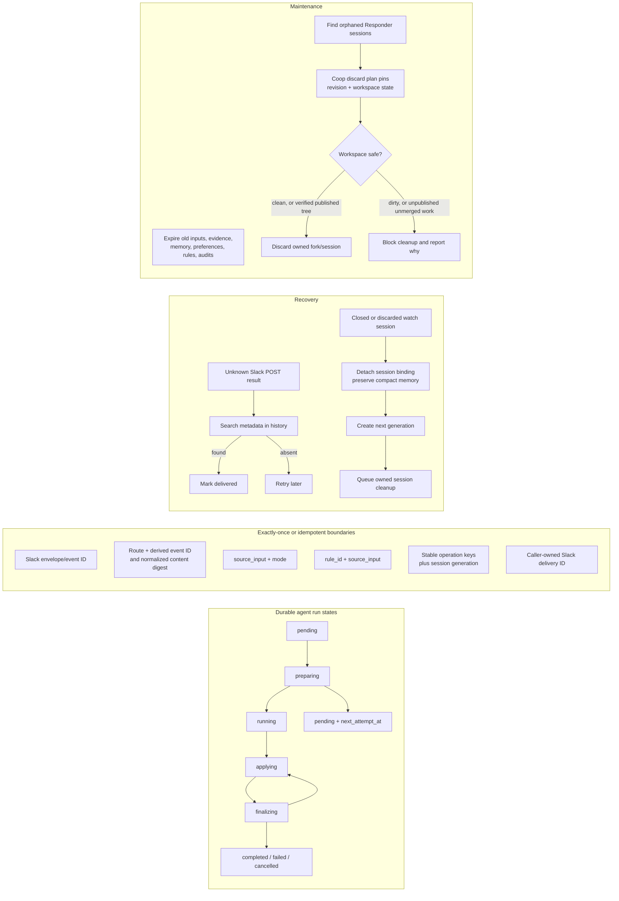

Key properties:

- SQLite uses WAL mode, full synchronous writes, and one connection.
- One durable scheduling index stores only work identity, lane, conversation key, priority, due
  time, retry state, and lease token. Domain payloads remain in typed tables.
- Expired scheduler leases are reclaimed during normal operation. Lease-token checks stop a stale
  worker from completing work reclaimed by another worker.
- Slack inputs are leased in timestamp order within a channel, but only an actively processing
  input holds that channel. Once it queues an agent run, it is complete and cannot exhaust retries
  while the model works.
- The control lane prioritizes slash commands and buttons; long Coop work runs independently in the
  background lane.
- A short settle delay lets nearby messages enter the context snapshot before submission. Responder
  reads channel history around the target or paginates an old thread, merges it with already
  admitted inputs, excludes unrelated threads, guarantees the root and target are present, and
  persists the resulting ordered snapshot on the run for exact restart reuse.
- After the first summarized turn in a conversation, the stored last-message timestamp becomes the
  Slack history cursor. Later turns load only the delta plus the compact summary.
- A delayed older event cannot reply after a newer channel decision has completed.
- Coop create results are refreshed through `GET` because an idempotent create replay describes the
  original creation state, not necessarily the current session state.
- Replacement watch sessions use generation-aware create and run keys.
- Posts, updates, and statuses use one durable, coalescing Slack delivery ledger. Ambiguous posts
  reconcile by metadata before retry; updates retry idempotently; per-thread status generations
  ensure an older progress write cannot supersede a newer clear.
- A terminal failed watch run queues a user-facing failure, clears pending status, detaches the
  session while preserving compact memory, and queues cleanup.
- Automatic cleanup operates only on exact Responder-owned session IDs. It never accepts dirty
  work, and it accepts unmerged work only after the exact reviewed tree has been durably published.
- Channel deletion removes conversation summaries, channel-scoped memory, preferences, and rules.
  Repository-scoped state remains until its own lifecycle or operator review removes it; automatic
  orphan reconciliation is not yet implemented. Normal maintenance prunes raw
  operational data and compact conversation summaries on their separate schedules. Older summaries
  are first consolidated into bounded weekly rollups: public channels by repository and private
  channels only within that channel. Source summaries are removed transactionally only after their
  rollup is durable. Confirmed operator memory is never rewritten by this process; stale and exact
  duplicate candidates enter a separate operator review queue.
- Accepted work carries a progress deadline. Maintenance surfaces an episode that has stopped
  advancing in its own thread, once per progress generation, naming the current state and what an
  operator can do. A second interval with no progress moves the episode to blocked rather than
  repeating the notice: an operator should see a state, not a second reminder. This is what makes
  "nothing accepted is silently abandoned" a property rather than an intention.

## 8. Main durable records

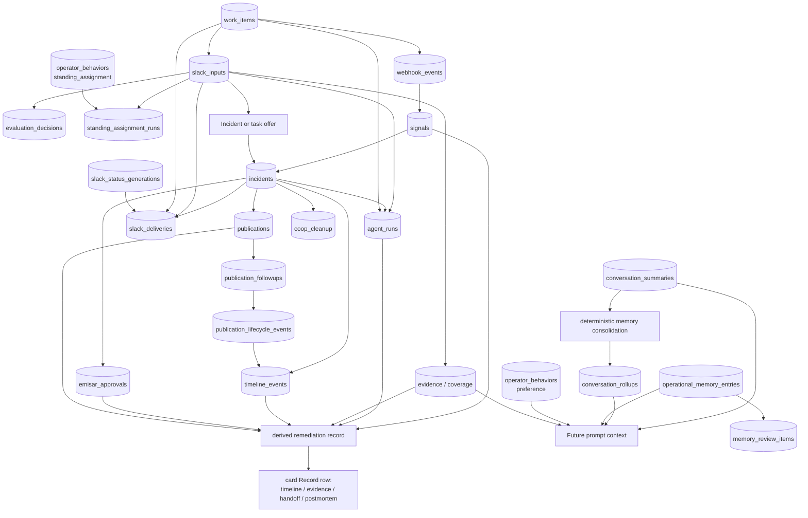

These are logical relationships. Not every arrow is a database foreign key; some are deliberately
bound by stable source IDs and idempotency keys so admission and recovery can remain independent.
